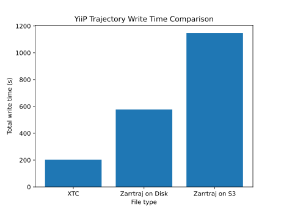
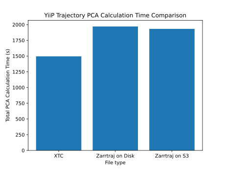
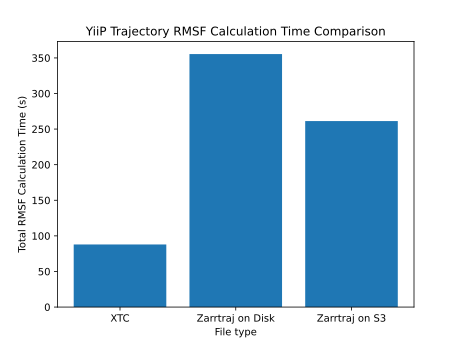

Benchmarks
==========

Nightly benchmarks
##################

Speed benchmarks are available via AirSpeedVelocity
`here <https://becksteinlab.github.io/zarrtraj/>`_

Inital benchmarking
###################

The following benchmarks were performed in the `Beckstein Lab <https://becksteinlab.physics.asu.edu/>`_
on an Ubuntu 22.04 machine with dual Intel Xeon E5-2665 2.40GHz 8-core processors, 32GB of RAM, and an 
NVIDIA GeForce 780 graphics card. Disk tests were performed on an NFS drive backed by SSD storage

File Writing Speed Test
^^^^^^^^^^^^^^^^^^^^^^^
Test code::

    import zarrtraj
    import MDAnalysis as mda
    import MDAnalysisData
    import zarr
    import os 
    import s3fs
    import time
    import json

    # Setup benchmarking
    write_speeds = dict()

    # 1. Download the 90ns YiiP trajectory to the local filesystem
    yiip = MDAnalysisData.yiip_equilibrium.fetch_yiip_equilibrium_long(data_home='notebook_data_tmp')
    u = mda.Universe(yiip.topology, yiip.trajectory)

    # 2. Write it into the xtc format on disk (for benchmarking comparative speed)
    start = time.time()
    with mda.Writer("notebook_data_tmp/yiip.xtc", u.atoms.n_atoms) as W:
        for ts in u.trajectory:
            W.write(u.atoms)
    stop = time.time()
    write_speeds["XTC"] = stop - start

    # 3. Write it into the zarrtraj format on disk
    zHDD = zarr.open_group("notebook_data_tmp/yiip.zarrtraj", mode = 'w')

    start = time.time()
    with mda.Writer(zHDD, u.atoms.n_atoms,
                    format='ZARRTRAJ') as W:
        for ts in u.trajectory:
            W.write(u.atoms)
    stop = time.time()
    write_speeds["Zarrtraj_Disk"] = stop - start

    # 4. Write it into the zarrtraj format on an accessible AWS S3 bucket
    # Use your own bucket here

    s3_fs = s3fs.S3FileSystem(
        # anon must be false to allow authentication
        anon=False,
        profile='sample_profile',
        client_kwargs=dict(
            region_name='us-east-1',
        )
    )

    cloud_store = s3fs.S3Map(
        root=f'zarrtraj-test-data/yiip.zarrtraj',
        s3=s3_fs,
        check=False
    )

    zS3 = zarr.open_group(store=cloud_store, mode='w')

    start = time.time()
    with mda.Writer(zS3, u.atoms.n_atoms,
                    n_frames=u.trajectory.n_frames,
                    format='ZARRTRAJ') as W:
        for ts in u.trajectory:
            W.write(u.atoms)
    stop = time.time()
    write_speeds["Zarrtraj_S3"] = stop - start

    with open('notebook_data_tmp/write_speeds.json', 'w') as j:
        json.dump(write_speeds, j)

Principal Component Analysis Speed Test
^^^^^^^^^^^^^^^^^^^^^^^^^^^^^^^^^^^^^^^

Test code::

    import zarrtraj
    import MDAnalysis as mda
    import zarr
    from zarr.storage import LRUStoreCache
    import s3fs
    import os
    import MDAnalysis.analysis.pca as pca
    import time
    import json

    # 1 Open a zzarr group from the aligned trajectory stored on disk
    yiipHDD = zarr.open_group("notebook_data_tmp/yiip.zarrtraj", mode='r')

    # 2 Open a group from the trajectory uploaded to an AWS S3 bucket
    s3_fs = s3fs.S3FileSystem(
        # anon must be false to allow authentication
        anon=False,
        # use profiles defined in a .aws/credentials file to store secret keys
        # docs: 
        profile='sample_profile',
        client_kwargs=dict(
            region_name='us-west-1',
        )
    )
    store = s3fs.S3Map(root=f'zarrtraj-test-data/yiip.zarrtraj',
                    s3=s3_fs,
                    check=False)
    cache = LRUStoreCache(store, max_size=10485760)
    yiipS3 = zarr.open_group(store=cache, mode='r')

    # 3 Create an universe for both zarr groups and one for the original .xtc trajectory
    uHDD = mda.Universe("notebook_data_tmp/yiip_equilibrium/YiiP_system.pdb", yiipHDD)
    uS3 = mda.Universe("notebook_data_tmp/yiip_equilibrium/YiiP_system.pdb", yiipS3)
    uXTC = mda.Universe("notebook_data_tmp/yiip_equilibrium/YiiP_system.pdb", "notebook_data_tmp/yiip.xtc")
    import MDAnalysis as mda
    
    #4 Perform the PCA analysis for each universe, time, and record results
    universes = dict()
    universes["uHDD"] = dict()
    universes["uHDD"]["ref"] = uHDD
    universes["uS3"] = dict()
    universes["uS3"]["ref"] = uS3
    universes["uXTC"] = dict()
    universes["uXTC"]["ref"] = uXTC

    for name in ("uHDD", "uS3", "uXTC"):
        start = time.time()
        PSF_pca = pca.PCA(universes[name]["ref"], select='backbone')
        PSF_pca.run()
        stop = time.time()
        universes[name]["PCA"] = stop - start

    pca_speeds = dict()
    pca_speeds["uXTC"] = universes["uXTC"]["PCA"]
    pca_speeds["uS3"] = universes["uS3"]["PCA"]
    pca_speeds["uHDD"] = universes["uHDD"]["PCA"]
    with open('notebook_data_tmp/pca_speeds.json', 'w') as j:
        json.dump(pca_speeds, j)

RMSF Speed Test
^^^^^^^^^^^^^^^
Test code::

    import zarrtraj
    import MDAnalysis as mda
    import zarr
    from zarr.storage import LRUStoreCache
    import s3fs
    import os
    import time
    from MDAnalysis.analysis import rms
    import json

    # 1 Open a zarr group from the aligned trajectory stored on disk
    yiipHDD = zarr.open_group("notebook_data_tmp/yiip_aligned.zarrtraj", mode='r')

    # 2 Open a group from the trajectory uploaded to an AWS S3 bucket

    s3_fs = s3fs.S3FileSystem(
        anon=False,
        profile='sample_profile',
        client_kwargs=dict(
            region_name='us-west-1',
        )
    )
    store = s3fs.S3Map(root=f'zarrtraj-test-data/yiip_aligned.zarrtraj',
                    s3=s3_fs,
                    check=False)
    cache = LRUStoreCache(store, max_size=10485760)
    yiipS3 = zarr.open_group(store=cache, mode='r')

    # 3 Create an universe for both zarr groups and one for the original .xtc trajectory
    uHDD = mda.Universe("notebook_data_tmp/yiip_equilibrium/YiiP_system.pdb", yiipHDD)
    uS3 = mda.Universe("notebook_data_tmp/yiip_equilibrium/YiiP_system.pdb", yiipS3)
    uXTC = mda.Universe("notebook_data_tmp/yiip_equilibrium/YiiP_system.pdb", "notebook_data_tmp/yiip_aligned.xtc")

    #4 Perform the RMSF analysis for each universe, time, and record results
    universes = dict()
    universes["uHDD"] = dict()
    universes["uHDD"]["ref"] = uHDD
    universes["uS3"] = dict()
    universes["uS3"]["ref"] = uS3
    universes["uXTC"] = dict()
    universes["uXTC"]["ref"] = uXTC

    for name in ("uHDD", "uS3", "uXTC"):
        c_alphas = universes[name]["ref"].select_atoms("protein and name CA")

        start = time.time()
        R = rms.RMSF(c_alphas).run()
        stop = time.time()

        universes[name]["RMSF_time"] = stop - start

    rmsf_speeds = dict()
    rmsf_speeds["uXTC"] = universes["uXTC"]["RMSF_time"]
    rmsf_speeds["uS3"] = universes["uS3"]["RMSF_time"]
    rmsf_speeds["uHDD"] = universes["uHDD"]["RMSF_time"]
    with open('notebook_data_tmp/RMSF_speeds.json', 'w') as j:
        json.dump(rmsf_speeds, j)

