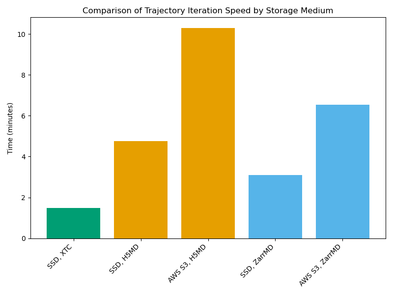

# Summary

Molecular dynamics (MD) simulations provide a microscope into the behavior of 
atomic-scale environments otherwise prohibitively difficult to observe, however,
the resulting trajectory data is too often siloed in a single institutions' 
HPC environment, rendering it unusable by the broader scientific community.
Zarrtraj enables these trajectories to be read directly from cloud storage providers
like AWS, Google Cloud, and Microsoft Azure into MDAnalysis, a popular Python 
package for analyzing trajectory data, providing a method to open up access to
trajectory data to anyone with an internet connection. Enabling cloud streaming
for MD trajectories empowers easier replication of published analysis results,
analyses of large, conglomerate datasets from different sources, and training
machine learning models without downloading and storing trajectory data.

# Statement of need

The computing power in HPC environments has increased to the point where
running simulation algorithms is often no longer the constraint in
obtaining scientific insights from molecular dynamics trajectory data. 
Instead, the ability to process, analyze and share large volumes of data provide 
new constraints on research in this field.

Other groups in the field recognize this same need for adherence to 
FAIR principles [@FAIR:2019] including the MDDB (Molecular Dynamics Data Bank), an EU-scale 
repository for biosimulation data [@MDDB:2024] and MDverse, a prototype search engine 
for publicly-available Gromacs simulation data [@MDverse:2024].
While these efforts currently offer prototype solutions for indexing and 
searching MD trajectory data, the problem of efficiently distributing the data remains. 

Though exposing download links on the open internet offers a simple solution to this problem,
on-disk representations of molecular dynamics trajectories often range in size 
with large datasets up to TBs in scale [@ParallelAnalysis:2010] [@FoldingAtHome:2020],
so a solution which could prevent this 
duplication of storage and unnecessary download step would provide greater utility 
for the computational molecular sciences ecosystem.

Enter `Zarrtraj`, the first fully-functioning tool to our knowledge that allows 
streaming trajectories into analysis software using an established trajectory format.
`Zarrtraj` is implemented as an `MDAnalysis` [@MDAnalysis:2016] `MDAKit` [@MDAKits:2023] that
enables streaming MD trajectories in the popular `HDF5`-based H5MD format [@H5MD:2014]
from AWS S3, Google Cloud Buckets, and Azure Blob Storage & Data Lakes without ever downloading them.
This is possible thanks to the `Zarr` [@Zarr:2024] package which allows 
streaming array-like data from a variety of storage mediums and [Kerchunk](https://github.com/fsspec/kerchunk), 
which extends the capability of `Zarr` by allowing it to read `HDF5` files.
Because it implements the standard `MDAnalysis` trajectory reader API,
`Zarrtraj` can leverage `Zarr`'s ability to read a file in parallel to perform analysis 
algorithms in parallel using the "split-apply-combine" paradigm. In addition to the `H5MD` format, 
`Zarrtraj` can stream and write trajectories in the experimental `ZarrMD` 
format, which ports the `H5MD` layout to the `Zarr` filetype.

One imported, `Zarrtraj` allows passing trajectory URLs just like ordinary files:
```python
import zarrtraj
import MDAnalysis as mda

u = mda.Universe("sample_topology.top", "s3://sample-bucket-name/trajectory.h5md")
```
Initial benchmarks show that `Zarrtraj` can iterate
through an AWS S3 cloud trajectory (load into memory one frame at a time)
at roughly 1/2 or 1/3 the speed it can iterate through the same trajectory from disk and roughly 
1/5 to 1/10 the speed it can iterate through the same trajectory in XTC format \autoref{fig:benchmark}.
However, it should be noted that this speed is influenced by network latency and that
writing parallelized algorithms can offset this loss of speed.



With `Zarrtraj`, we envision research groups making their data publicly available 
via a cloud URL so that anyone can reuse their trajectories and reproduce their results.
Large databases, like MDDB and MDverse, can expose a URL associated with each 
trajectory in their databases so that users can make a query and immediately use the resulting
trajectories to run an analysis on the hits that match their search. Groups seeking to 
collect a large volume of trajectory data to train machine learning models can make use
of our tool to efficiently and inexpensively obtain the data they need from these published 
URLs.

This work builds on the existing `MDAnalysis` `H5MDReader`
[@H5MDReader:2021], and similarly uses `NumPy` [@NumPy:2020] as a common interface in-between `MDAnalysis`
and the file storage medium. `Zarrtraj` was inspired and made possible by similar efforts in the 
geosciences community to align data practices with FAIR principles [@PANGEO:2022].


# Acknowledgements
Thank you to Dr. Jenna Swarthout Goddard for supporting the GSoC program at MDAnalysis. 
Thank you to Martin Durant, author of Kerchunk, for helping refine and merge features in his upstream codebase 
necessary for this project. Finally, thank you to Google for supporting the Google Summer of 
Code program (GSoC) which provided financial support for this project.

# References